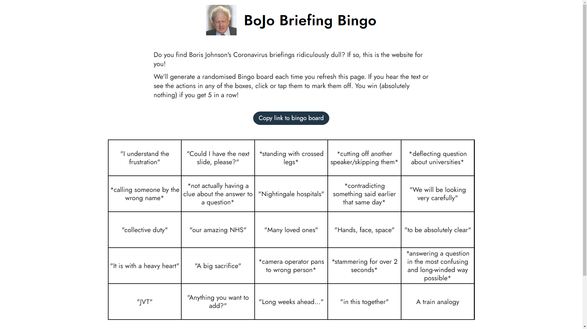

# Boris Johnson COVID Briefing bingo

Do you find Boris Johnson's Coronavirus briefings ridiculously dull? Play a game of BoJo Bingo: mark off each phrase and action as they happen in real time.

## Screenshot

## Permalinks

Permalinks are available for every bingo board, and will always work for as long as the site exists.

## Creating your own boards

You can create your own boards! Check out [the code for how our boards are encoded](https://github.com/davwheat/boris-johnson-covid-bingo/blob/master/src/functions/EncodeGameBoard.js) for full info, but in a nutshell...

1. Create a list of all your desired entries (>256 chars will be ignored)
2. Base 64 encode them all (one by one)
3. Join all encoded entries with commas
4. Base 64 encode the comma-delimited string
5. Add final string to end of this URL: `https://borisbingo.com/?items=`

Yes, this does make the URLs super long, but it also means I need no backend store of bingo boards! Woohoo! Most social media sites also shorten and/or truncate URLs automatically, anyway.

## Contact me

The best way to get in contact is via email. You can find my email address on my GitHub profile.
